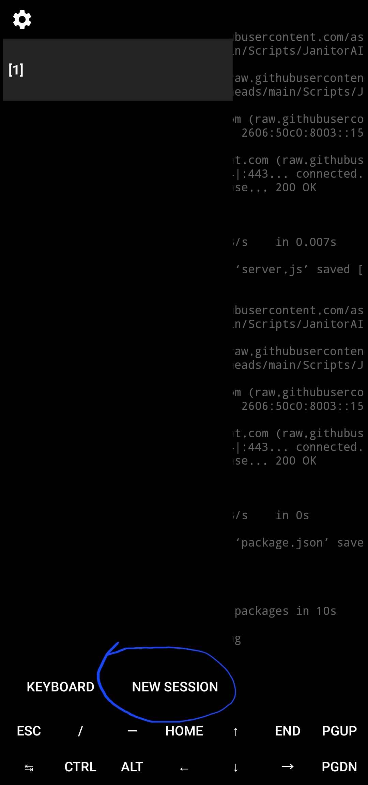
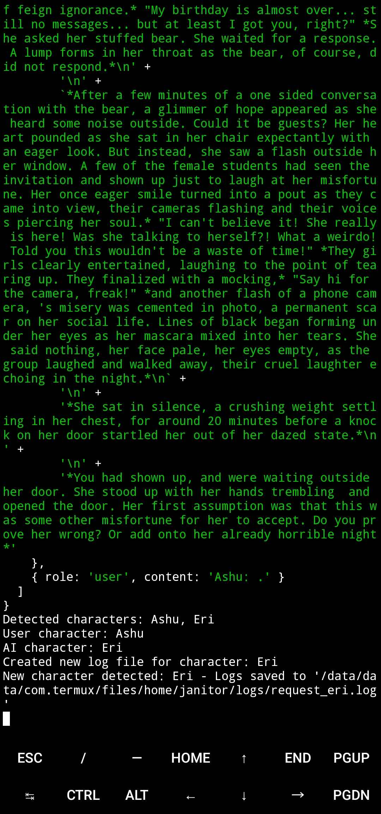
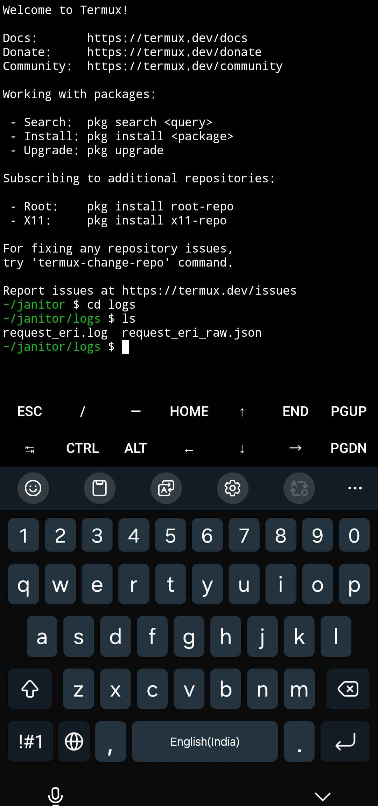

# Guide on how to scrap janitor AIs hidden definition character cards details

## For Linux, Windows and Mac:

### 1. Setting up server.

1. First of all download these two files and keep them in a folder together: [server.js](../Scripts/JanitorAI/server.js) and [package.json](../Scripts/JanitorAI/package.json) like this: [image](../Images/janitorAI//janitor-scrapper.png) 
2. Then:
    - If you are on windows, right click an empty space and open terminal in the folder.
    - If you are on linux/mac, open terminal to that folder.
3. Run `npm i` in the terminal. "This is one time step only."
4. Then, run `node server.js`. It will start the node js server.

### 2. Setting up cloudflare.

1. Setup cloudflare try on your system. [link](https://developers.cloudflare.com/cloudflare-one/connections/connect-networks/do-more-with-tunnels/trycloudflare/)
2. Run this command by opening other terminal window.
    `cloudflared tunnel --url http://localhost:3000`
3. Wait for few seconds and you will get a url something like this.

    
4. Copy the url that is ending with "trycloudflare.com".

### 3. Setup in Janitor AI

1. Open [Janitor AI](https://janitorai.com/)

> [!WARNING]
> It only works for the character cards that are proxy enabled.

2. Go to your desired proxy enabled card and start chat.
3. Click on the upper right corner where it is written "Using Janitor" or "Using ...".
4. Select "proxy" among the options.
5. Select custom in model and keep other settings like this.

    
6. In the url box, paste the trycloudflare url that you copied before and add this in the end `/v1/chat/completions`
7. Add `mock-model-1` in model name and `custom-key` in API key field box.
8. Scroll down and click on save settings.
9. Refresh the chat page
10. Now send any message like "hi".

### 4. Final Steps:

1. After sending, come to your terminal where the node js server is running.
2. You will see something like this:

    
3. You will also find a file name "requests.log" in the folder where server.js file is.
4. You will find two XML tags wrapped section, one with your persona name and another with character card name.
5. The details between the tags like in my case `<Seirra>` and `</Seirra>` is the information of the character card.
6. Just copy the details either from the "requests.log" file or from the terminal output and paste it inside SillyTavern.
7. Close both the terminal after you are done.

**Voila! This way you can copy any proxy enabled character card from janitor ai. Have Fun! 😉**

## For Android (using termux):

1. First of all, you should have the latest version of **termux** in your phone.
2. Type these commands one by one **(first time only)**:
    ```bash
    apt update && apt upgrade
    apt install wget nodejs cloudflared php
    mkdir janitor
    cd janitor
    wget https://raw.githubusercontent.com/ashuotaku/sillytavern/refs/heads/main/Scripts/JanitorAI/server.js
    wget https://raw.githubusercontent.com/ashuotaku/sillytavern/refs/heads/main/Scripts/JanitorAI/package.json
    npm i
    ```
3. Starting the server **(you have to do this everytime, if you close and reopen the terminal)**:
    1. Type this command in termux: `node server.js`.
    2. Open another new session of termux (you can do this by sliding from left corner to open the termux menu and then click new session). 

        
    3. Type this in the new session terminal: `cloudflared tunnel --url http://localhost:3000`
    4. Wait for few seconds and you will get a url something like this.

    
    5. Copy the url that is ending with "trycloudflare.com".
    6. Open janitor ai and setup like this, same step as in computer, refer to the 3rd heading: [Setup in Janitor AI](#3-setup-in-janitor-ai).
    7. After sending message, open the 1st terminal and if you see green texts like this, then it means you are successful.

    
    8. Create another session of termux.
        1. Type these:
            ```bash
            cd logs
            ls
            ```
        2. You will see at least two files with name like this: request_{{char}}.log

        
        3. Now type this command: `cat request_{{char}}.log` replace {{char}} with the name of character showing in your terminal, like in my case it is `cat request_eri.log`.
        4. The response will be like this:

        
        5. Everything inside the XML tag with the character name `{{char}}`, like in my case it is `<Eri>` will be the character description, everything inside `<scenario>` will be the scenario, everything inside `<example_dialogs>` will be the example chats and everything inside the `<firstmessage>` will be the first message of the character card.
        6. You can copy paste this data in your SillyTavern in the respective field and for image you can download it from the page of the character of janitor ai.
        7. Now, you can exit from all the terminal, it's done, **enjoy now.**